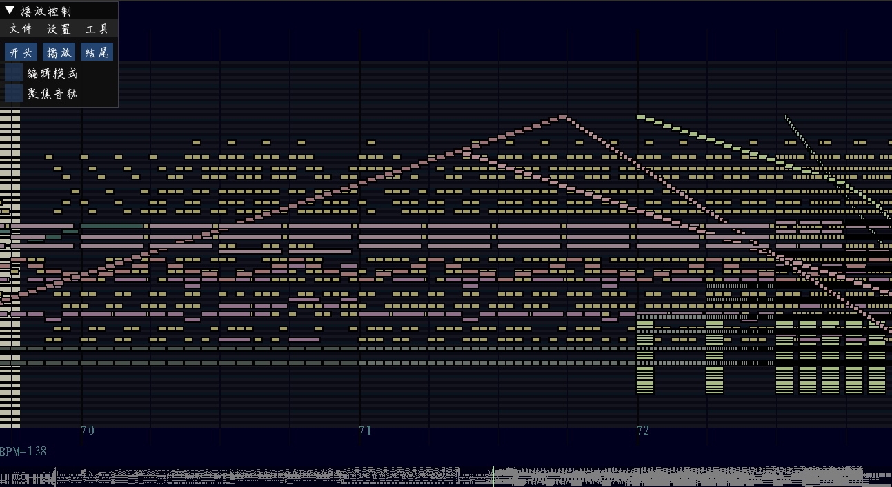
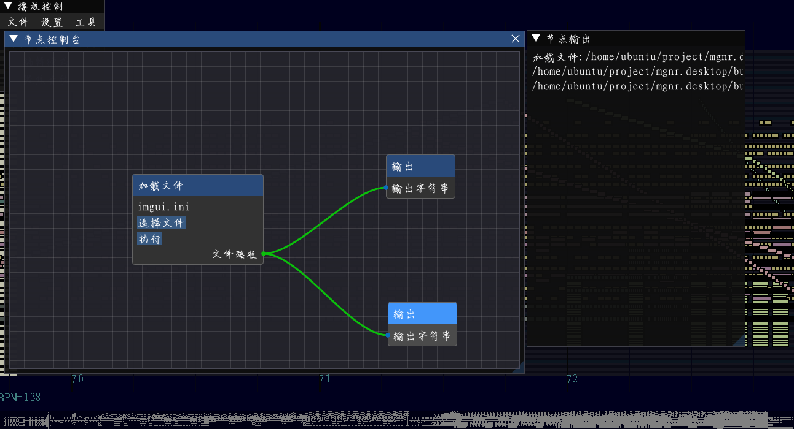

# mGenNer 轻量级 midi 编辑器

本项目基于 imgui 开发，内置 midi 编辑器与节点编辑器功能，适用于 midi 批量处理




## 使用方法
```
mkdir build
cmake ../src -D CMAKE_C_COMPILER=/usr/local/gcc-10.2.0/bin/gcc -D CMAKE_CXX_COMPILER=/usr/local/gcc-10.2.0/bin/g++
make
./mgnr
```